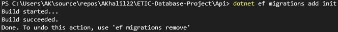

# ETIC-Database-Project
ASP.NET REST API with MSSQL and Python integration for ETIC project

## Overview of the project
 - **ASP.NET RESTful API** with **MSSQL** database
 - **Python Client** that interacts with the API via CRUD operations

[](https://lucid.app/lucidchart/8cd5f38c-9247-4c70-ac44-19bb6f1d3266/edit?viewport_loc=-3558%2C-1755%2C3757%2C1764%2C0_0&invitationId=inv_15b414e5-8086-49a0-a558-516344e0969d)

## Requirements
- [Visual Studio (Optional)](https://visualstudio.microsoft.com/downloads/)
- [.NET 5.0](https://dotnet.microsoft.com/download/dotnet/5.0)
- [Python 3.9](https://www.python.org/downloads/)
- [SQL Server](https://www.microsoft.com/en-us/sql-server/sql-server-downloads)

## Installation
#### 1. Clone the repository
```bash
git clone https://github.com/AKhalil22/ETIC-Database-Project.git
```

#### 2. Install the required packages
```bash
cd ETIC-Database-Project
dotnet restore
```

#### 3. Connect the MSSQL database

Update DefaultConnection String under Api > appsetting.json, replacing the Server and Database values with your own
```json
"ConnectionStrings": {
	"DefaultConnection": "Data Source={PCNAME}\\SQLEXPRESS;Initial Catalog={DATABASENAME};Trusted_Connection=True;MultipleActiveResultSets=true"
  }
```

Initialize database connection
```bash
dotnet tool install --global dotnet-ef
cd ETIC-Database-Project/Api
dotnet ef migrations add Init
```

Should look like this:


Then run:
```bash
dotnet ef database update
```
Refresh your database & dbo.Expenses should be created within your database! 

#### 4. Install Python Client Requirements & Run
```bash
cd ETIC-Database-Project/client
pip install -r requirements.txt
python main.py
```

#### 5. Run the API
```bash
cd ETIC-Database-Project
dotnet run
```
