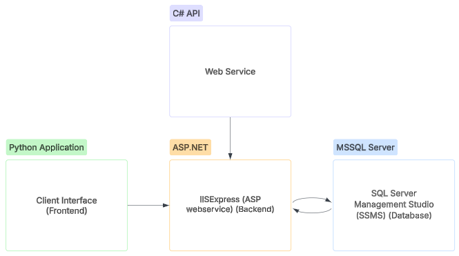

# ETIC-Database-Project
ASP.NET REST API with MSSQL and Python integration for ETIC project

## Overview of the project
 - **ASP.NET RESTful API** with **MSSQL** database
 - **Python Client** that interacts with the API via CRUD operations

[](https://lucid.app/lucidchart/8cd5f38c-9247-4c70-ac44-19bb6f1d3266/edit?viewport_loc=-3558%2C-1755%2C3757%2C1764%2C0_0&invitationId=inv_15b414e5-8086-49a0-a558-516344e0969d)

## Requirements
- [.NET 5.0](https://dotnet.microsoft.com/download/dotnet/5.0)
- [Python 3.9](https://www.python.org/downloads/)
- [SQL Server](https://www.microsoft.com/en-us/sql-server/sql-server-downloads)

## Installation
1. Clone the repository
```bash
git clone https://github.com/AKhalil22/ETIC-Database-Project.git
```
2. Install the required packages
```bash
cd ETIC-Database-Project
dotnet restore
```
3. Install the MSSQL database
```bash
cd ETIC-Database-Project
dotnet ef database update
```
4. Install the Python client
```bash
cd ETIC-Database-Project/client
pip install -r requirements.txt
```
5. Run the API
```bash
cd ETIC-Database-Project
dotnet run
```